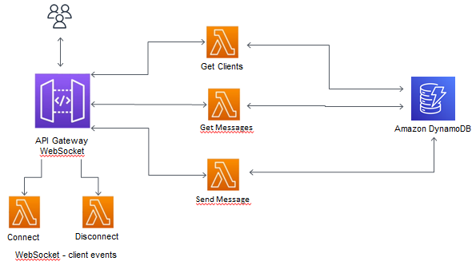

# webchat-aws-serverless-with-nodejs-typescript

This is a serverless web chat conversation app. It was developed using NodeJs, typescript and some AWS services, such as DynamoDb and APIGateway.

## Requirements

- [AWS CLI](https://aws.amazon.com/cli/)
- [Node.js 14](https://nodejs.org/)
- [Serverless Framework’s](https://www.serverless.com/framework/docs/getting-started)

It is necessary to have an AWS account configured so that it is possible to deploy the application in the cloud.

## Diagram

  

## License

MIT License
